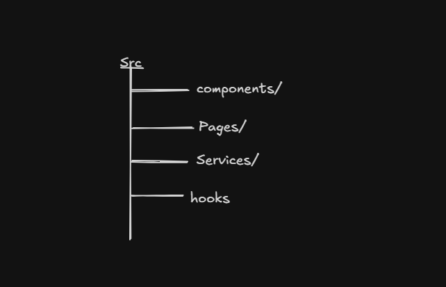
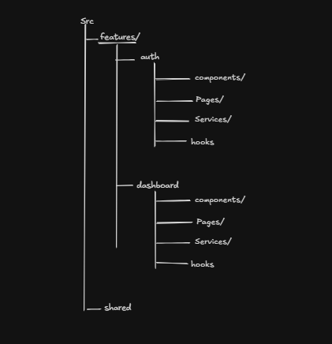
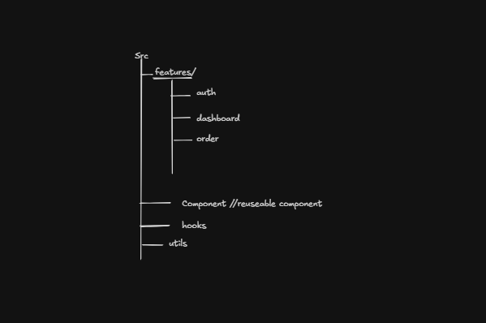
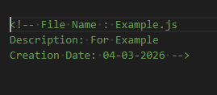
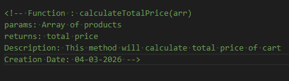
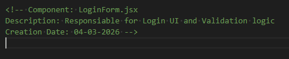

# Frontend-System-Design

In simple terms, Frontend System Design (FSD) is the "master plan" for how a web application is built.
Frontend System Design as the blueprint for building a large-scale web application.

## Why Folder Structure is important

In small folder sturcture does not matter much but in large scale application.

- Scalabality
- Clean Architecture
- Better Team work
- Reuseablity
- Faster Development
- Easy Testing
- Easy Debugging

## Different Type of Folder Stucture

- Layer based Structure(Traditional)

  
  - Files are grouped by type(Layer) like component services, utils, styles
  - Suitable for small project

- Feature based Structure

  
  - Not suitable for large project

- Hybrid Structure

  
  - Combination of layer based + feature based

## Naming Convention and Documentation

- Easy to maintain
- Team friendly
- You quickly remember what the function or file performing
- Less time spent on understaning the old code
- Faster code fixing
- Code becomees self explaintory
- New developers will understand the purpuse of code quickly
- Avoid duplicacy code

### Folder Naming Rule

- Use lowercase, meaningful and plural names
  - eg. components, images, pages

### File Naming Rules

- Component and Pages files name should be in Pascal case.
  - eg. Header.jsx, LoginForm.jsx
- Non-component files should be in Non-Pascal case.
  - eg. authService.js, applicant.js

### Variable Naming Rules

- Use Camel-case and boolean variable name should start with is, has and can.
  - eg. username, isLoggedIn

### Function Naming Rules

- use Camel-Case and meaningful name
  - eg. calculateTotalPrice();

### Description and Comment Rules

- Always add description and comment for files, function, components. To avoid copy-pasting, for quick understanding of file, function and components
- Always write rule in RULES.md or README.md file
  
  
  
